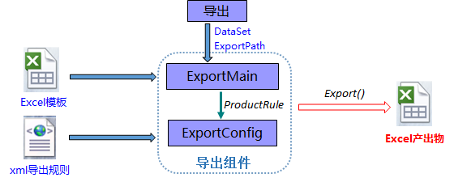
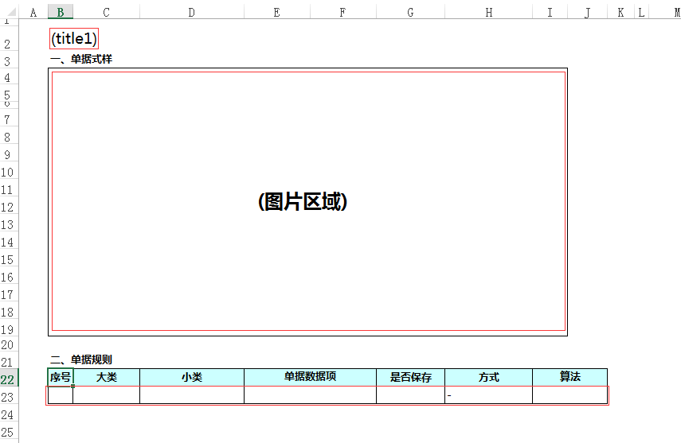
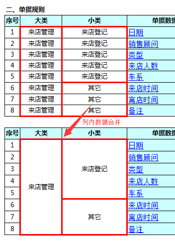
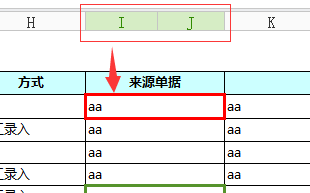
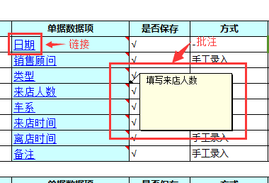
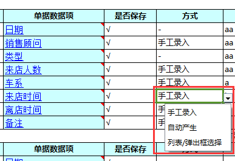
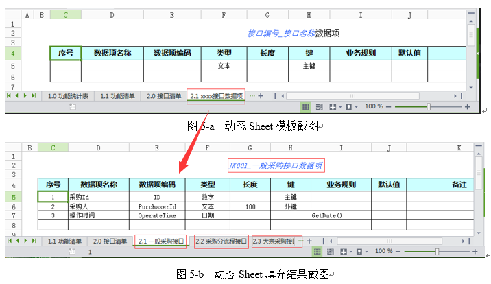
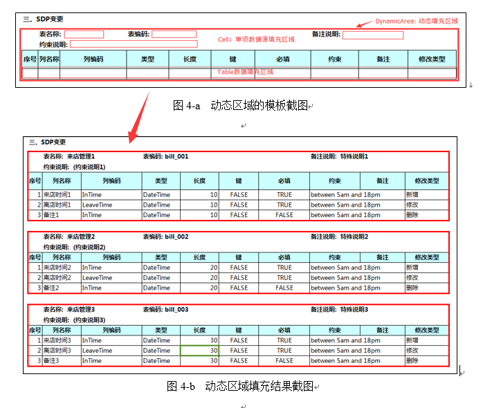
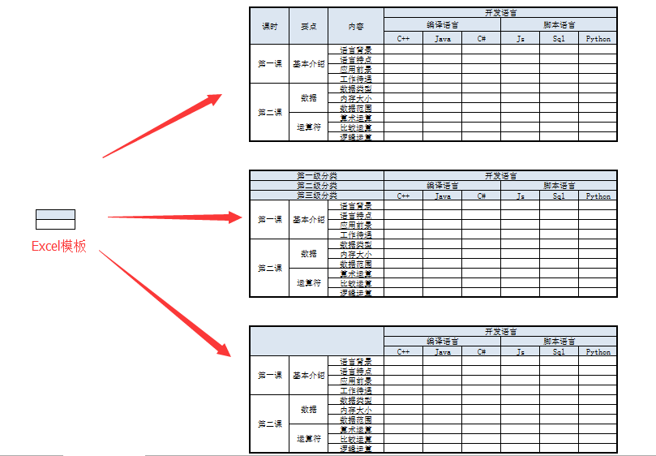
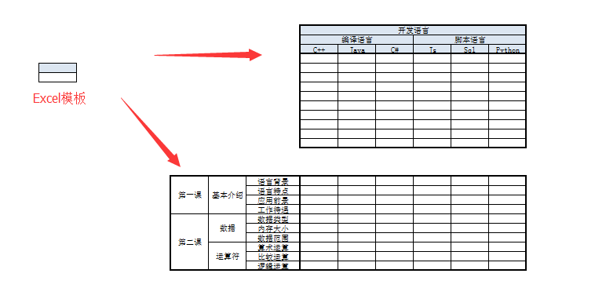

# ExcelTemplate

## 什么是ExcelTemplate

`ExcelTemplate`项目是一个基于Excel模板，依靠配置文件描述导出过程的Excel导出工具。
它提供了大量适用于各种场景的常用配置（导出规则），同时提供一些供外部使用的扩展接口，以满足一些特殊应用。
比较适合于具有大量Excel导出功能的场景中。

ExcelTemplate依赖于[NPOI](http://npoi.codeplex.com)项目实现对Excel的底层操作。

**为什么要基于Excel模板？**

NPOI当然支持对Excel单元格各类外观样式的操作。但是基于外观的操作过于复杂（这跟NPOI工具本身没关系），可能比真正要导出数据的展示方式要写更多的代码。
但是从实际应用中发现，导出Excel的外观样式要求并不是太高，而且样式几乎都是有规律。
因此`ExcelTemplate`项目采用了基于Excel模板导出的方式：先手动制定一个Excel模板，然后从Excel模板中读取样式，然后在相同数据空间中复用这些样式。
这样，**既消除了繁杂的样式书写逻辑，又保证了外观样式可自由配置**。

**使用配置文件描述导出规则有什么好处呢？**

ExcelTemplate将一些常用导出规则固化为一个个配置项，导出数据的控制逻辑（在哪里输出？怎么输出？）完全由配置文件`ExportConfig.xml`定义。
为满足大多数场景，描述导出规则的这些配置项被定义到适宜的粒度，并可在各种场景中自由组合使用。
使用配置实现的导出逻辑，**完全不用关心底层代码逻辑，在需求多变的环境中，只需修改配置相关参数即可，避免了修改代码逻辑和重新编译部署带来的麻烦**。

**为什么选择NPOI？**

使用NPOI直接对Excel文档以文件流的直接处理，而不用安装并调用Office相关组件，大大简化了开发和部署的麻烦工作，而且性能较之office组件高很多。

## 如何使用？

** 你需要做什么 **

使用`ExcelTemplate`你需要做以下三步：
+ 手动制作Excel模板
+ 在`ExcelTemplate.xml`配置文件中配置使用什么数据，在哪里输出数据，怎么输出
+ 提供数据源`DataSet`，并使用ExportMain.Export()方法导出

    

** 示例 **
下面将以导出一个包含标题、图片、数据表等数据项的简单Excel为例说明`ExcelTemplate`使用步骤。

1.准备Excel模板: Demo.xlsx
  
  
2.配置导出规则

``` xml
<?xml version="1.0"?>
<ExportConfig xmlns="http://tempuri.org/schema.xsd">
  <ExportProduct name="Demo" description="An example" template="ExcelTemplate\Demo.xlsx">
    <DataSource name="dsname">
      <DataList name="SaveSource" value="√,"/>
      <DataList name="WaySource" value="手工录入,自动产生,列表/弹出框选择"/>
    </DataSource>
    <Sheets>
      <Sheet name="Sheet1">
        <Cells>
          <Cell location="B2" source="Cells.Title" />
          <Cell location="C5:H18" source="Cells.Picture"  fill="stretch" />
        </Cells>
        <Tables>
          <Table location="B23" source="Form">
            <RowNum />
            <Field name="Category1" colIndex="2" spannable="true"></Field>
            <Field name="Category2" colIndex="3" spannable="true"></Field>
            <Field name="Item" colIndex="4"  annnotationField="LinkAddr"
                   refField="LinkAddr" linkType="auto"></Field>
            <Field name="Save" colIndex="6" dropDownListSource="SaveSource" emptyFill="-"></Field>
            <Field name="Way" colIndex="7" dropDownListSource="WaySource" emptyFill="-" spannable="true"></Field>
            <Field name="Algorithm" colIndex="13" emptyFill="-"></Field>
          </Table>
        </Tables>
      </Sheet>
    </Sheets>
  </ExportProduct>
</ExportConfig>
```
注意：如果这里的Table如果没有这些单元格横向纵向合并、下拉框、链接等特殊输出，只是纯文件内容的话，可以更简单配置如下
``` xml
<ExportConfig xmlns="http://tempuri.org/schema.xsd">
  <ExportProduct name="Demo" description="An example" template="ExcelTemplate\Demo.xlsx">
    <Sheets>
      <Sheet name="Sheet1">
        <Cells>
          <Cell location="B2" source="Cells.Title" />
          <Cell location="C5:H18" source="Cells.Picture"  fill="stretch" />
        </Cells>
        <Tables>
            <Table location="B23" source="Form" fields="Category1,Category2,Item,Save,Way,Algorithm">
                <RowNum/>
            </Table>
        </Tables>
      </Sheet>
    </Sheets>
  </ExportProduct>
</ExportConfig>
```
关于更多配置，请详见`ExportConfigTemplete.xml`。

3.准备数据源：DataSet

``` CSharp
    DataSet dataSet = new DataSet("Demo");
    DataTable dt = new DataTable("Cells");
    dt.Columns.Add("Title");
    dt.Columns.Add("Picture", typeof(byte[]));
    dt.Rows.Add("来店登记统计表");

    using (FileStream filestream = new FileStream(Path.Combine(path, "ExcelTemplate\\FormStyle.jpg"), FileMode.Open, FileAccess.Read))
    {
        byte[] bytes = new byte[(int)filestream.Length];
        filestream.Read(bytes, 0, bytes.Length);
        dt.Rows[0]["Picture"] = bytes;
    }
    dataSet.Tables.Add(dt);

    dt = new DataTable("Form");
    dt.Columns.Add("Category1");
    dt.Columns.Add("Category2");
    dt.Columns.Add("Item");
    dt.Columns.Add("Save");
    dt.Columns.Add("Way");
    dt.Columns.Add("Algorithm");
    dt.Columns.Add("Annotation");//用于批注
    dt.Columns.Add("LinkAddr");//用于链接
    dt.Rows.Add("来店管理", "来店登记", "日期", "√", null, null, "填写日期", "http://baidu.com");
    dt.Rows.Add("来店管理", "来店登记", "销售顾问", "√", "手工录入", 1, "填写销售顾问名称", "file:///E:/DotNetWorkingSpace/MyTestPlatform/Console");
    dt.Rows.Add("来店管理", "来店登记", "类型", "√", null, "2", "填写业务类型", "Sheet2!A1");
    dt.Rows.Add("来店管理", "来店登记", "来店人数", "√", "手工录入", "3", "填写来店人数", "http://baidu.com");
    dt.Rows.Add("来店管理", "其它", "来店时间", "√", "手工录入", "5", "填写来店时间", "mailto:test@126.com");
    dataSet.Tables.Add(dt);

    ExportMain.Export(dataSet, exportfilepath);
```
>**需要注意**
+ DataSet的名称必须指定为配置元素ExportProduct的名称Demo
+ Table名称为Cell的DataTable，用于指定单元格数据来源，如标题、图片区域
+ DataTable的字段名对应配置文件中指定的

## ExcelTemplate能做哪些功能

1、孤立数据项（像标题、图片之类）

2、表格数据

>+ 行号
>+ 列对应数据源字段：位置 + 输出数据类型
>+ 合并：行内合并、列内相同数据合并
>+ 额外输出：批注、链接（内部链接、URL、文件路径、Email）、下拉框数据
>+ 列数据汇总

**行合并**



**列合并**



** 批注和连接 **



** 下拉框 **



3、动态Sheet

一个Sheet作为模板，动态输出多个类似的Sheet（Sheet中输出数据格式一致，但是输出数据都不相同）。



4、动态区域
以指定的区域为模板，向下动态地产生多个相同样式的区域并填充数据



5、多级行列标题

动态生成行列，且可以是多级标题





## 下一步计划
1. 支持模板表达式
2. 数据分组统计
3. 配置SQL提取数据源
4. 较远的计划：基于配置的Excel读取功能
